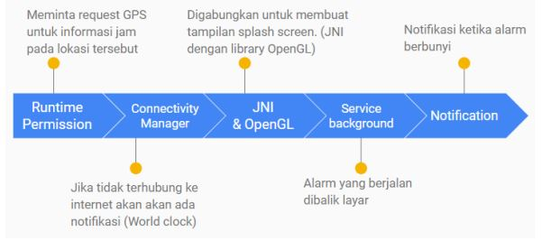
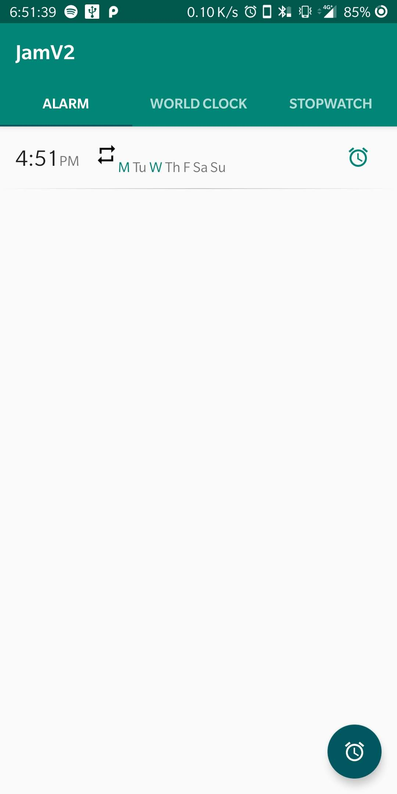
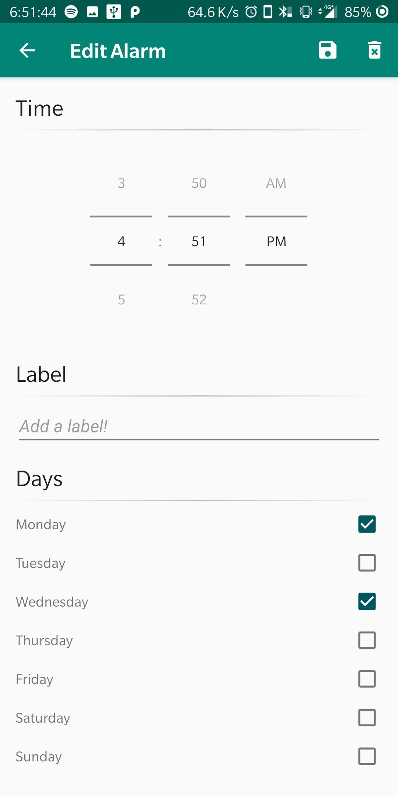
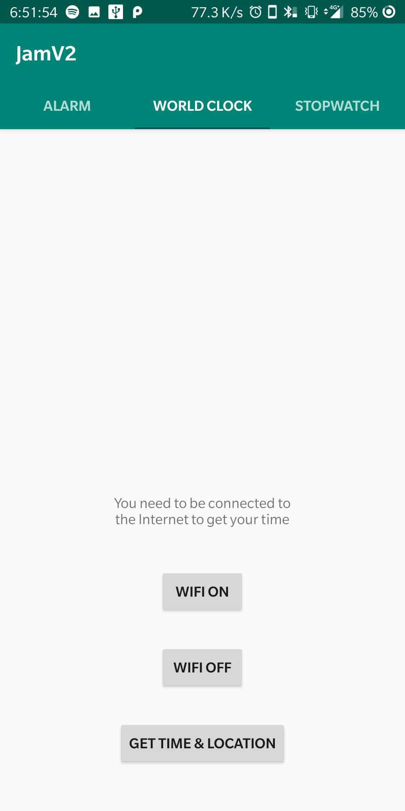
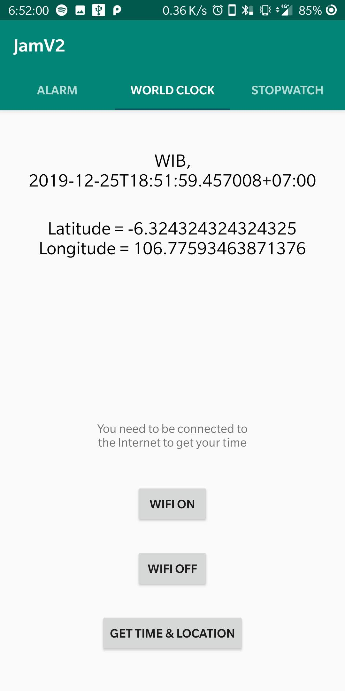
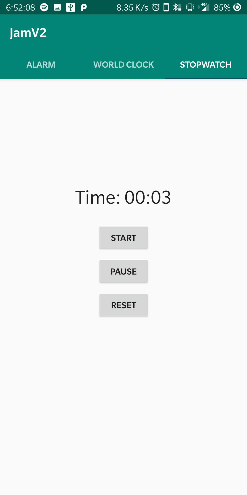

# JamAppV2
Aplikasi jam sederhana dengan fitur stopwatch dan alarm

# Penjelasan Aplikasi
• Aplikasi merupakan aplikasi lanjutan dari tugas tengah semester yaitu aplikasi Jam.
Pada tugas tengah semester saya membuat aplikasi dengan fitur stopwatch, Timer,
dan Alarm.
• Pada iterasi/versi kedua aplikasi Jam saya ini, saya memperbaiki dan menambakan
improvement pada fitur-fiturnya dan juga memangkas satu fitur yang menurut saya
kurang relevan untuk requirements pada tugas akhir in.
• Penambahan fitur world clock yang fungsinya mengembalikan waktu pada tempat
yang dispecify dan mengembalikan lokasi user.
• Terdapat juga fitur mengubah state wifi (connectivity manager) karena fitur world
clock membutuhkan internet.
• Penambahan notifikasi dan service background pada alarm manager.
• Menghilangkan fitur Timer.
• Rencana pada slide presentasi :

# Tampilan
 
  